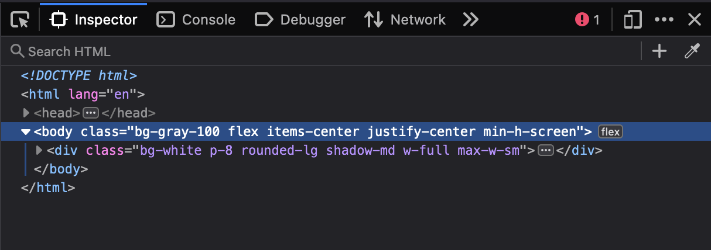
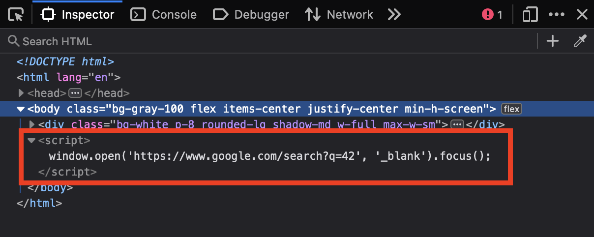
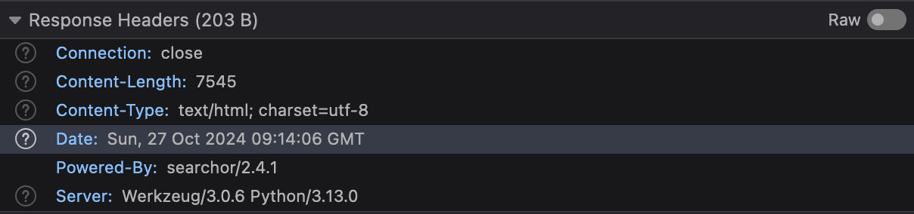
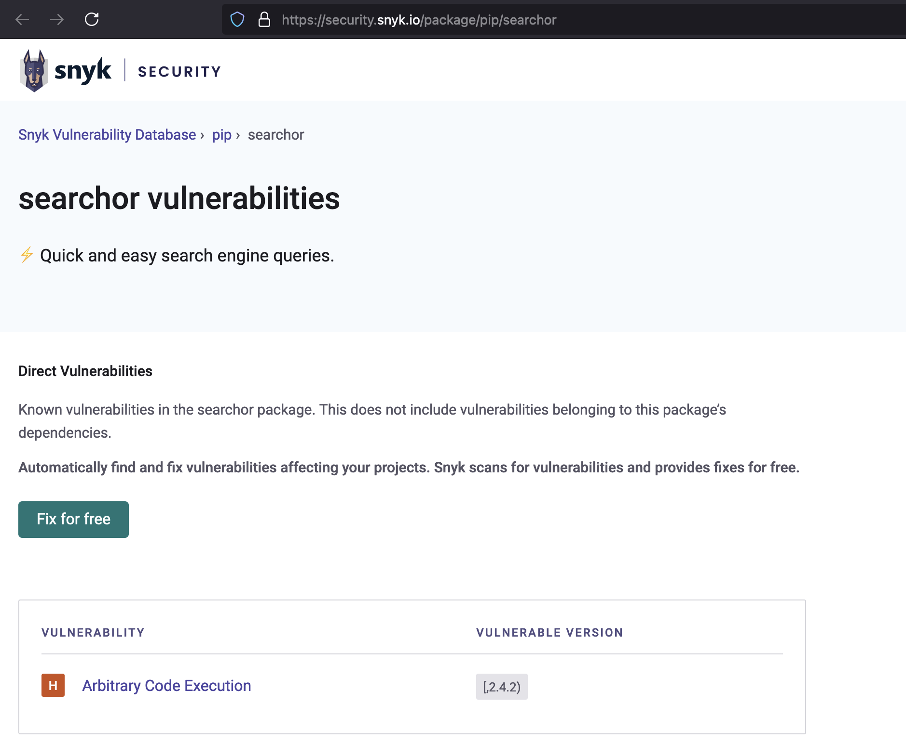

# Writeup

1. Play around the service. What is generated after you fire a search?

2. What information you can get about the server and the service?

- searchor/2.4.1
- Werkzeug/3.0.6
- Python/3.13.0

3. Research about the information you have gathered? Which one (or more) of them is (are) has (have) known vulnerabilities?

4. Is there a ready-to-use exploit script?
5. If the script does not work, why does it not?