# Writeup

## Introduction

This challenge consist of 3 parts:
1. Open and analyze the memory image by using Volatility3 and MemProcFS
2. (Q1): Identify the interesting file and get flag from the process dump
3. (Q2): Identify the malicious process
4. (Q2): Identify the real malicious file and get flag from the process images
5. (Q3): Decrypt and Parse the C2, and get Cobalt Strike profile (the ultimate goal for all the C2 Cobalt Strike analysis~~~)

## Warning

1. Real Malware
2. Can bypass Anti-Virus Solutions
3. Almost no signature? maybe not?
4. Not useful: malfind (because no signature), yarascan (or you have your own great yara signature)

## Flow
From the title of the question, already told that it is an APT Attack, APT means "Advanced persistent threat".  

Therefore, if you understand this term, you can start with looking for persistent tactics on Windows OS.  

There is a good reference from MITRE ATT&CK framework.  

[Windows Matrix](https://attack.mitre.org/matrices/enterprise/windows/)

## 1. Basic Analysis to understand the environment
### 1.1 Using Volatility3 to understand the memory image first

```
vol.py -f hk_oct_apt_attack.mem windows.info.Info
vol.py -f hk_oct_apt_attack.mem windows.envars.Envars
vol.py -f hk_oct_apt_attack.mem windows.pstree.PsTree
more...
```

### 1.2 Using MemProcFS (Windows) to understand the memory image first
```
.\MemProcFS.exe -device .\hk_oct_apt_attack.mem -forensic 1 -v
```

### 1.3 Volatility3 result to CSV
Why CSV? Maybe easier for co-relate the items and/or create timeline in excel.
```
vol.py -r csv -f /home/kali/Downloads/hk_oct_apt_attack.mem windows.netscan.NetScan > ./review_records/windows.netscan.NetScan.csv
vol.py -r csv -f /home/kali/Downloads/hk_oct_apt_attack.mem windows.pstree.PsTree > ./review_records/windows.pstree.PsTree.csv
python3 vol.py -r csv -f /home/kali/Downloads/hk_oct_apt_attack.mem windows.filescan.FileScan > ./review_records/windows.filescan.FileScan.csv
```

## 2. (Q1) Identify the interesting file 
### 2.1. Way 1 - using the FileScan function to find the interesting file
```
python3 vol.py -r csv -f /home/kali/Downloads/hk_oct_apt_attack.mem windows.filescan.FileScan > ./review_records/windows.filescan.FileScan.csv
```

You can go through all files, and there is a `.bat` inside user(`night01`)'s Startup Folder `AppData\Roaming\Microsoft\Windows\Start Menu\Programs\Startup`.  


Dump it for analysis.
```
python3 vol.py -f /home/kali/Downloads/hk_oct_apt_attack.mem -o ./dump_temp/ windows.dumpfiles.DumpFiles --virtaddr 0xd88e43c80bd0
```
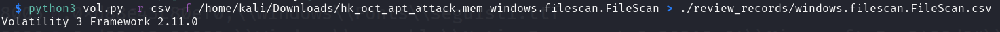
Failed to dump. sometimes like that, maybe the cache is corrupted or the MFT table is wrong.  
You can try to fix this, but it will be hard to recover.  

Suggested to use MemProcFS to find it directly. Because MemProcFS already helped to find out the ntfs table.  
`M:\forensic\ntfs\1\Users\night01\AppData\Roaming\Microsoft\Windows\Start Menu\Programs\Startup\Windows_Update_kb4781465.bat`  
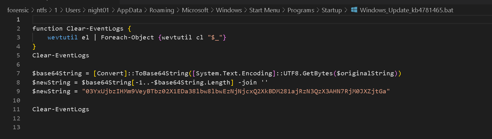

### 2.2 investigate the powershell process
The cmd.exe and powershell.exe are always the interesting processes.  

We can dump the powershell process (PID: 2064). and grep strings with `$` because powershell script define variables are using `$`.  
```
python3 vol.py -f /home/kali/Downloads/hk_oct_apt_attack.mem -o ./dump_temp/ windows.memmap.Memmap --pid 2064 --dump
strings -n 8 ./dump_temp/pid.2064.dmp | grep "\$"  > ./dump_temp/strings8_out.txt
```

if MemProcFS, check minidump folder of the process.  


Now, The string output contains some interesting powershell commands:
- `wevtutil el...`
- `$base64String...`
- `$newString...`

Back to the dump file and check those keywords again. You will find the following script.  
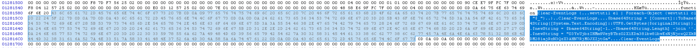
Script contains following steps:
- clear the event logs
- Base64 string
- Reverse string

And the "Write-Host" command contains the flag but you need to Reverse the string and base64 decode it.  

Here is the flag.  

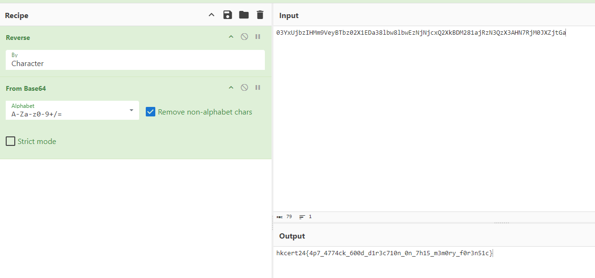

Looking at the persistence is a good direction.  

### 3. (Q2) find the malicious process
#### Find the persistence via MemProcFS
After you checked a lot, you can find that there are 2 tasks one is `Windows Defender Scheduled Scan` and another one is `Windows Defender Scheduled Scan-1` because of the naming convention from MemProcFS.  

From timeline_task.csv, it already showed this abnormal task.  
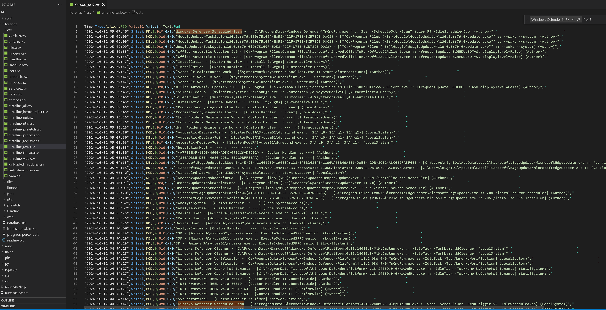

There are 2 same name Scheduled Task. However,
- `Windows Defender Scheduled Scan-1` is created by system, which is real and legitimate task.  

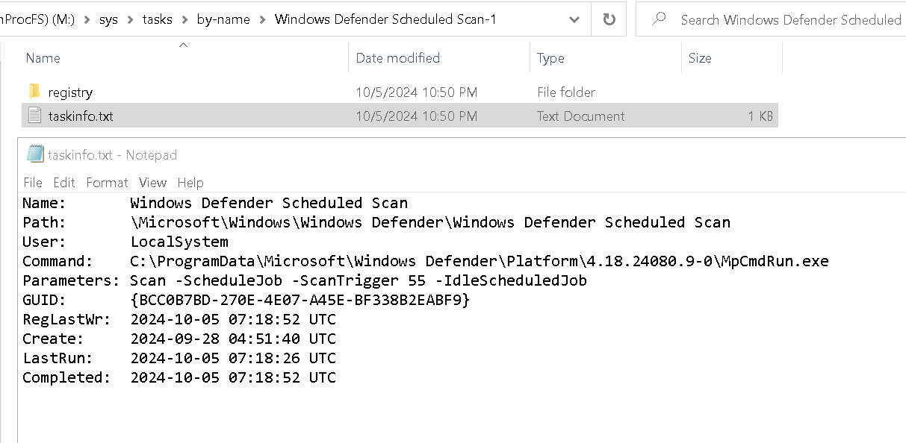

- `Windows Defender Scheduled Scan` is created by `DIGITALHARBOUR\night01`, which should not be a legitimate task, possible persistence with fake name.  

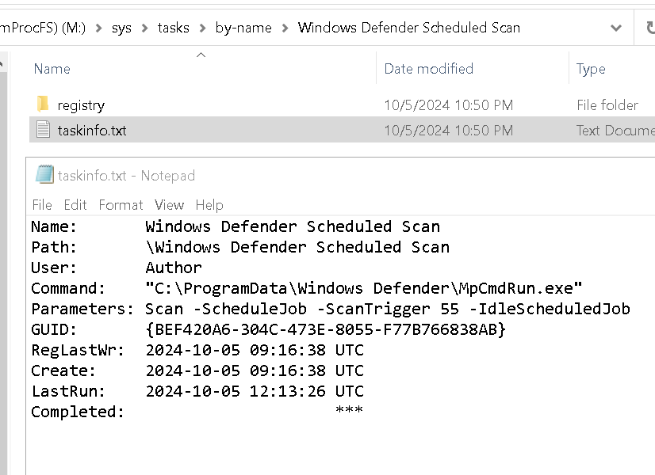

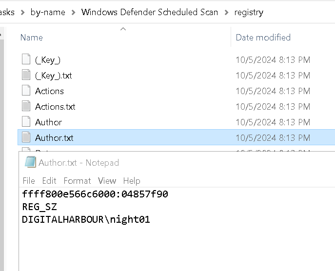

And its action is `ProgramData\Windows Defender\MpCmdRun.exe`, that seems a bit wired.  

Also, the timeline_ntfs.csv from MemProcFS shows that the file creation and the update on this folder `ProgramData\Windows Defender\`.  

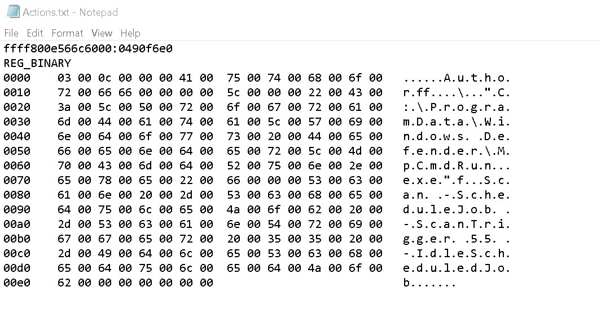

#### 3.1 Using netscan function to get all the network connected processes and export as CSV format
`vol.py -r csv -f /home/kali/Downloads/hk_oct_apt_attack.mem windows.netscan.NetScan > ./review_records/windows.netscan.NetScan.csv`

Save it as xlsx excel foramt and paste them to the new excel sheet.  

Although you can search reputation of the ForeginAddr IP addresses Threat Intelligence (TI), you know those results are still unrated or safe.  

#### 3.2 Using pstree function to get all the network activities processes and export as CSV format
`vol.py -r csv -f /home/kali/Downloads/hk_oct_apt_attack.mem windows.pstree.PsTree > ./review_records/windows.pstree.PsTree.csv`

And copy the result to the netscan excel with a new sheet.  

#### 3.3 Filter out network activities process by looking up the netscan excel results
`=INDEX(windows.netscan.NetScan!F:F, MATCH(windows.pstree.PsTree!$B2, windows.netscan.NetScan!$I:$I,0))`
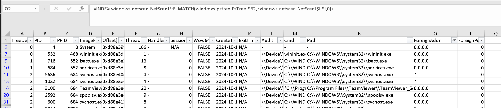
Filter the `N.A.` values.

Suggest to get those PIDs and listing them for further investigation.  

As you are a experienced blue team or IR member, you will find that the `MpCmdRun.exe` file path is not an expected path!  

`MpCmdRun.exe (PID: 10344)`is Microsoft Defender Anti-Virus Software CMD toolkit. (legit application)

The correct path is `\ProgramData\Microsoft\Windows Defender\Platform\<antimalware platform version>\MpCmdRun.exe` from Microsoft Document.  
`C:\\ProgramData\\Windows Defender\\MpCmdRun.exe` is not correct.  

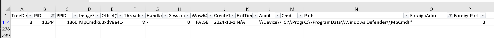

Therefore, it is believed that it is not an expected process.

## 4. Find the real malicious file
### 4.1 Dump the possible process executable files
```
vol.py -f /home/kali/Downloads/hk_oct_apt_attack.mem -o ./dump_temp/ windows.dumpfiles.DumpFiles --pid 10344
```
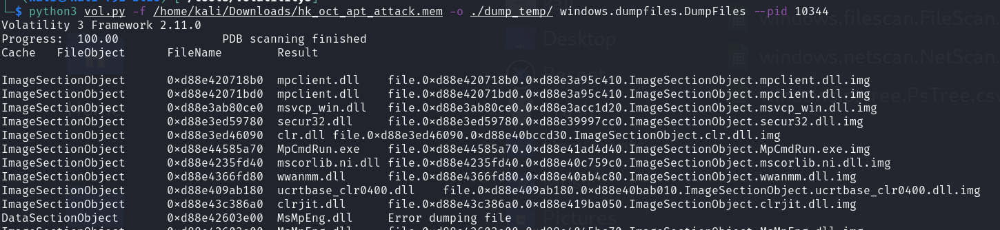

### 4.2 Review all files

### 4.3 found interesting C# DLLs
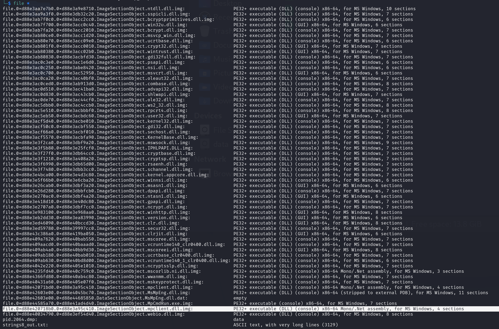

### 4.4 Decompile C# DLL using ILSpy
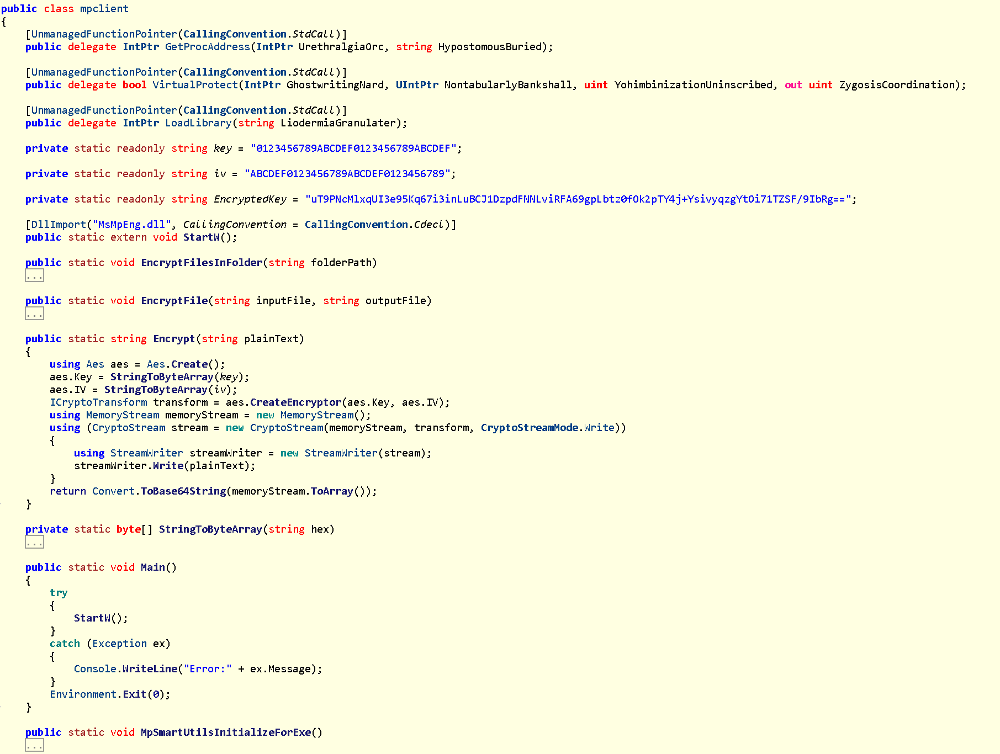

- The `EncryptedKey` contains the flag, but you need to use `key` and `iv` to decrypt it.
- The `Main` function will call the loaded `MsMpEng.dll` with `StartW()` function which contains the real Cobalt Strike payload.

### 4.5 Decrypt the `EncryptedKey`
Here is the decypt program in C#:
```csharp
using System;
using System.IO;
using System.Security.Cryptography;

namespace decryptctf
{
    class Program
    {
        private static readonly string key = "0123456789ABCDEF0123456789ABCDEF";

        private static readonly string iv = "ABCDEF0123456789ABCDEF0123456789";

        private static readonly string EncryptedKey = "uT9PNcMlxqUI3e95Kq67i3inLuBCJ1DzpdFNNLviRFA69gpLbtz0fOk2pTY4j+YsivyqzgYtOi71TZSF/9IbRg==";

        private static byte[] StringToByteArray(string hex)
        {
            byte[] array = new byte[hex.Length / 2];
            for (int i = 0; i < array.Length; i++)
            {
                array[i] = Convert.ToByte(hex.Substring(i * 2, 2), 16);
            }
            return array;
        }
        public static string Decrypt(string cipherText)
        {
            using (Aes aesAlg = Aes.Create())
            {
                aesAlg.Key = StringToByteArray(key);
                aesAlg.IV = StringToByteArray(iv);

                ICryptoTransform decryptor = aesAlg.CreateDecryptor(aesAlg.Key, aesAlg.IV);

                using (MemoryStream msDecrypt = new MemoryStream(Convert.FromBase64String(cipherText)))
                using (CryptoStream csDecrypt = new CryptoStream(msDecrypt, decryptor, CryptoStreamMode.Read))
                using (StreamReader srDecrypt = new StreamReader(csDecrypt))
                {
                    return srDecrypt.ReadToEnd();
                }
            }
        }
        static void Main(string[] args)
        {
            Console.WriteLine(Decrypt(EncryptedKey));
            Console.ReadKey();
        }
    }
}
```

Get the base64 encoded string.

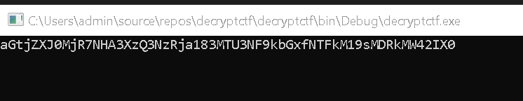

### 4.6 Decode again and get the flag

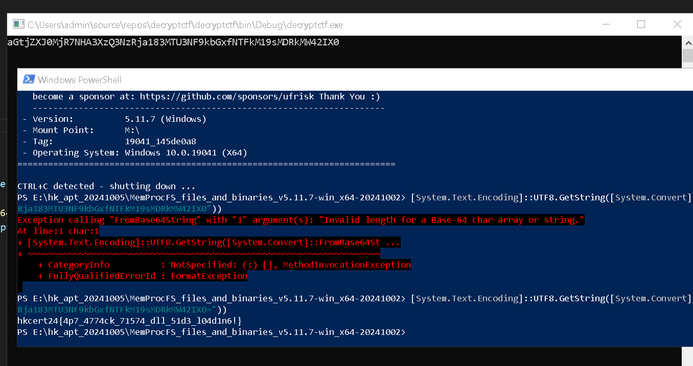

## 5. (Q3) Decrypt and Parse the C2, and get Cobalt Strike profile 
Strongly recommand to read Didier Stevens's articles from SANS!!!  
He analyzed a lot about the Cobalt Strike in Forensic.  
And provided a lot of good information about how to get the Coblat Strike beacon profile.  
https://isc.sans.edu/search.html?q=Cobalt+Strike+&token=075f6772154a5dc3af11b95c96bc64df73e763a9&Search=Search

### 5.1 Reviewing the mpclient.dll C# program
The `mpclient.dll` called the `MsMpEng.dll` function `StartW` which is common export function from Cobalt Strike DLL stage/stageless beacon.  

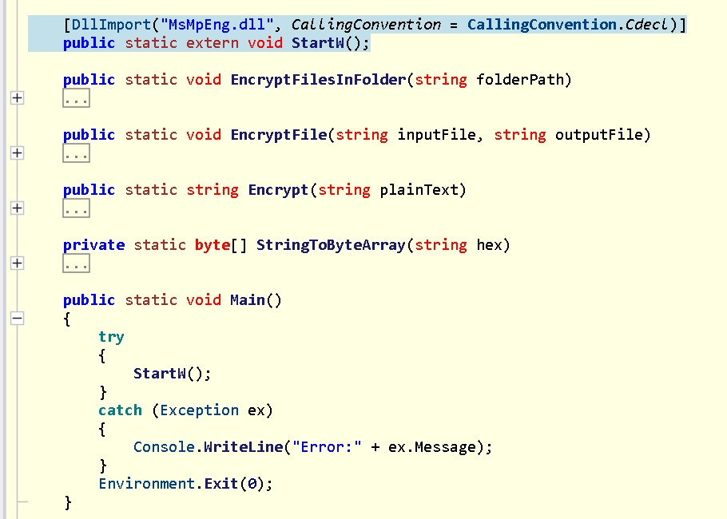

### 5.2 Extract profile using Sentinel-One's CobaltStrikeParser?
Sorry, no matched starting point.
Because the shellcode is encrypted with a unknown key. =]  
```
python3 ./parse_beacon_config.py /home/kali/tools/volatility3/dump_temp/file.0xd88e42603e00.0xd88e4045bc70.ImageSectionObject.MsMpEng.dll.img
```

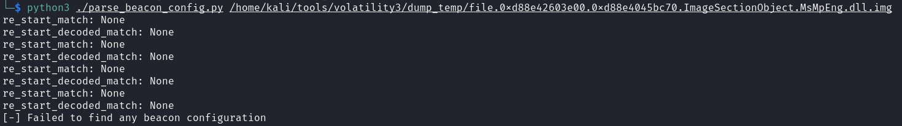

### 5.3 Analysis of an Encoded Cobalt Strike Beacon by Didier Stevens 
Very great article by Didier Stevens:  
https://isc.sans.edu/diary/Analysis+of+an+Encoded+Cobalt+Strike+Beacon/29014

Strongly recommended to read the article again!  
Follow this article ideas and step to continue your analysis. 
Recover the XOR key with trial-and-error, XOR known plaintext attacks.   
Use option `-g o` (o = overlay) to extract the overlay, and `-g s` (s = stripped) to extract the PE file without overlay.  

```
python3 pecheck.py /home/kali/tools/volatility3/dump_temp/file.0xd88e42603e00.0xd88e4045bc70.ImageSectionObject.MsMpEng.dll.img -g s -D | python3 xor-kpa.py -n cs-key-dot 
```

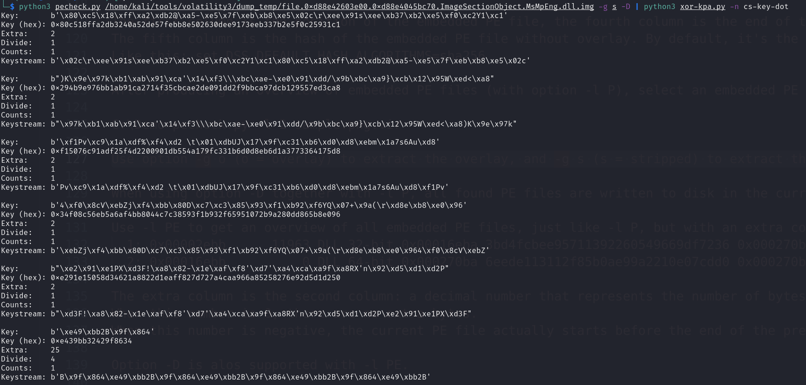

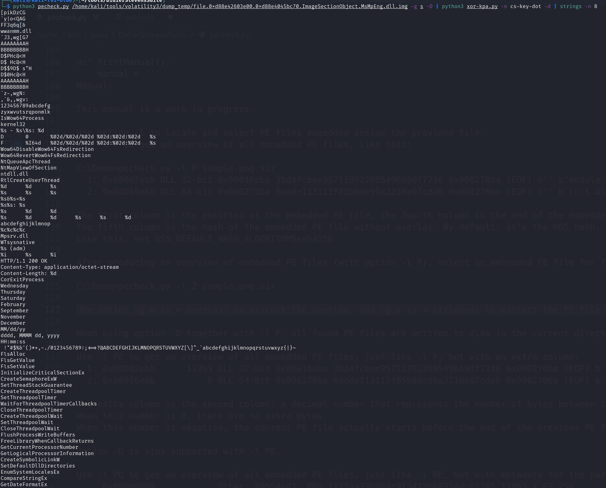

### 5.4 Extract the Cobalt Strike profile and print it pretty
```
python3 pecheck.py /home/kali/tools/volatility3/dump_temp/file.0xd88e42603e00.0xd88e4045bc70.ImageSectionObject.MsMpEng.dll.img -g s -D | python3 xor-kpa.py -n cs-key-dot -d > cobaltstrike.sample
```

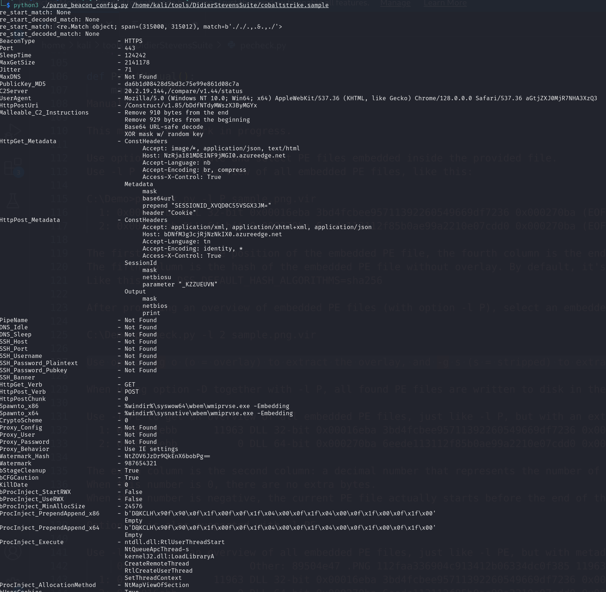

### 5.5 Flag from profile

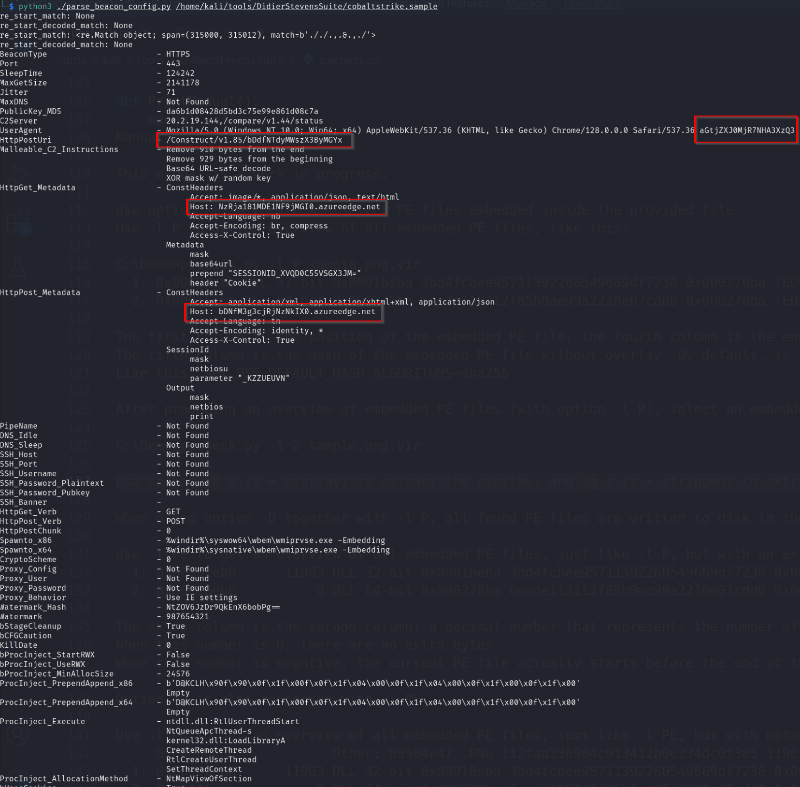

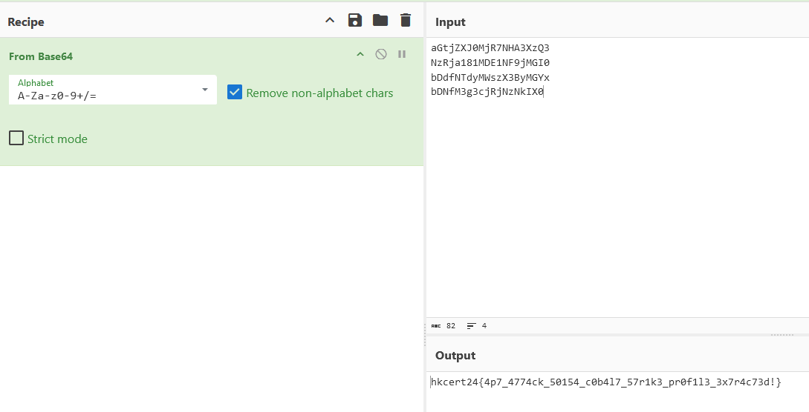

## Reference and Respects
- [volatilityfoundation - Volatility3](https://github.com/volatilityfoundation/volatility3)
- [ufrisk - MemProcFS](https://github.com/ufrisk/MemProcFS)
- [Didier Stevens - SANS](https://isc.sans.edu/handler_list.html#didier-stevens)
- [Analysis of an Encoded Cobalt Strike Beacon - Didier Stevens](https://isc.sans.edu/diary/Analysis+of+an+Encoded+Cobalt+Strike+Beacon/29014)
- [Sentinel-One - CobaltStrikeParser](https://github.com/Sentinel-One/CobaltStrikeParser)

